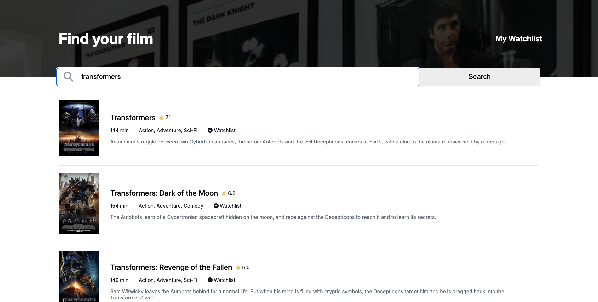

# Movie Watchlist

A simple, client-side web application for searching movies and maintaining a personal watchlist. The application fetches data from the OMDb API and uses browser local storage to persist the user's selections.

**Live Demo:** [https://moovie-watchlist.netlify.app/](https://moovie-watchlist.netlify.app/)

<!-- Add a screenshot or GIF of your application in action -->
 

## Overview

This project is a single-page application that allows users to search for movies by title. Search results are displayed with key details such as the movie poster, rating, runtime, and a brief plot summary. Users can add movies from the search results to a personal watchlist. The watchlist is saved in the browser, so it remains available even after the page is closed and reopened.

## Features

-   **Movie Search**: Search for movies by title using the OMDb API.
-   **Dynamic Results**: Fetches and displays a list of movies with relevant details.
-   **Watchlist Management**: Add movies to a personal watchlist or remove them.
-   **Data Persistence**: The watchlist is saved using the browser's `localStorage`, ensuring it is available across sessions.
-   **Two-Page View**: A single-page application that toggles between the search view and the watchlist view without a page reload.

## Built With

-   HTML5
-   CSS3 (with Flexbox for layout)
-   Vanilla JavaScript (ES6+)

No external libraries or frameworks were used in this project.

## Project Purpose

The primary goal of this project was to practice and demonstrate proficiency in:

-   Working with a third-party REST API (OMDb API) using `async/await` and the `Fetch` API.
-   Manipulating the DOM with vanilla JavaScript to render dynamic content.
-   Using browser `localStorage` for client-side data persistence.
-   Handling user events and managing application state on the client side.
-   Structuring a small project with separate HTML, CSS, and JavaScript files.

## API Used

This project utilizes the [OMDb API](http://www.omdbapi.com/) for movie data. An API key is required and is included in the `index.js` file for demonstration purposes.

## How to Run Locally

To run this project on your local machine, follow these steps:

1.  Clone the repository:
    ```sh
    git clone https://github.com/your-username/your-repo-name.git
    ```
2.  Navigate to the project directory:
    ```sh
    cd your-repo-name
    ```
3.  Open the `index.html` file in a web browser. No build steps or local server are required.